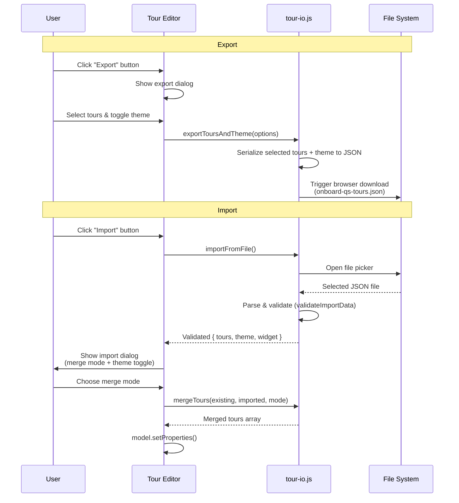

# Onboard Tour

Interactive onboarding tours for Qlik Sense apps — no coding required.  
This fork is developed and tested in **Qlik Cloud**. Client-managed Qlik Sense support is inherited from the original project and has not been validated for this fork.

Drop this extension onto any Qlik Sense sheet to create guided, step-by-step walkthroughs that highlight objects, explain visualisations, and help new users find their way around your apps.

Maintained by Tyler Osterman as an enhanced fork of [Onboard.qs](https://github.com/ptarmiganlabs/onboard.qs), originally created by Göran Sander and Ptarmigan Labs. The original MIT license and attribution are retained.

**Installing in Qlik?** Download the **`onboard-qs.zip` release asset** from [this fork's releases](https://github.com/tosterman/onboard.qs/releases). Upload that ZIP directly, without extracting it. **Code → Download ZIP** and **Source code (zip)** are development source archives, not installable extensions.

In the sheet editor, find **Custom objects → Tyler's Custom Extensions → Onboard Tour**. The internal extension ID and ZIP filename remain `onboard-qs` so existing app objects keep using the same extension.

---

## Features

- **Qlik basics checklist (fork enhancement)** — in the existing Tour Editor, select a tour and click **Include Qlik basics**. Check filtering, clearing one/all filters, undo, creating/applying bookmarks, or exporting chart data. Choose a sheet object for filtering/export, then click **Add selected steps** and **Save**. Generated steps use the normal editor, styling, ordering, preview and import/export. They are guided practice with manual Next, not enforced task completion. Prepared toolbar selectors target Qlik Cloud; preview in your own app.

- **Visual tour builder** — full-screen modal editor with three-panel layout (tours / steps / details). No need to leave the Sense app to configure tours.
- **Multiple tours per sheet** — define intro tours, advanced walkthroughs, or feature announcements, each with independent settings.
- **Sheet object targeting** — select any object on the current sheet from a dropdown. The extension resolves the correct DOM element at runtime.
- **Custom CSS selector targeting** — target any DOM element (toolbar buttons, header items, other extensions) with a raw CSS selector.
- **Markdown descriptions** — step descriptions support Markdown: **bold**, _italic_, [links](url), , lists, blockquotes, inline code, and more.
- **Auto-start with show-once** — tours can launch automatically when the sheet loads and remember whether the user has already seen them.
- **Theme presets & color pickers** — choose from four built-in presets (Default, The Lean Green Machine, Corporate Blue, Corporate Gold) or override every color individually. Font sizes, border radii, font weight, and font family are all configurable.
- **Configurable appearance** — button label, style (primary/secondary/minimal/outlined/pill), horizontal & vertical alignment, progress indicator, keyboard navigation, overlay colour, stage padding/radius, popover button text.
- **Hide hover & context menus** — per-object toggles to hide the Qlik Sense hover menu (three-dot / expand) and right-click context menu, overriding app-level settings.
- **Toolbar button** — optionally inject a "Start Tour" button into the Qlik Sense app toolbar (top-right area). Coexists with [HelpButton.qs](https://github.com/ptarmiganlabs/help-button.qs) without visual overlap. The in-sheet widget can be hidden when the toolbar button is the only trigger.
- **Tour import / export** — export all tours (plus theme and widget settings) to a JSON file, and import them back with three merge modes. Great for sharing tours across apps or backing up configurations.
- **Qlik property panel integration** — everything is also accessible from the standard Qlik Sense property panel in edit mode (tours, steps, settings).
- **Lightweight** — small footprint with only two runtime dependencies: [driver.js](https://driverjs.com/) (~5 KB gzip) for tour rendering and [DOMPurify](https://github.com/cure53/DOMPurify) (~7 KB gzip) for HTML sanitisation.

|                                                                                            |                                                                                                               |
| ------------------------------------------------------------------------------------------ | ------------------------------------------------------------------------------------------------------------- |
|  |  |
| _Tour editor — build tours without leaving the app_                                        | _A tour step highlighting a sheet object_                                                                     |

---

## Getting Started

### Prerequisites

- A Qlik Cloud tenant where you have permission to upload or update extensions.
- Permission to edit the app and sheet where you will author tours.

### Download

1. Open [**this fork's Releases**](https://github.com/tosterman/onboard.qs/releases).
2. Expand **Assets** for the version you want. Fork builds may be marked **Pre-release**.
3. Download the asset named **`onboard-qs.zip`**. Version `1.8.3-basics.5` is approximately **73 KB**.
4. Keep the ZIP intact for upload. Do not select **Source code (zip)** or GitHub's **Code → Download ZIP**.

The source repository contains development tools, tests, and documentation. Demo videos and the animated GIF have been removed from the current feature branch; older source archives and Git history still contain them.

### Install in Qlik Sense

**Qlik Cloud:**

1. Open Qlik Cloud **Administration** and go to **Extensions**.
2. Add a new extension and upload **`onboard-qs.zip`**. If `onboard-qs` is already installed, use its **Edit** action, replace the ZIP, and click **Save**.
3. Refresh the app, enter sheet edit mode, and open **Custom objects → Tyler's Custom Extensions**.
4. Drag **Onboard Tour** onto the sheet.

**Client-managed (QSEoW):**

The upstream project provides QMC installation support, but this fork has not been validated on client-managed deployments. Test in your own environment before rollout.

### Create Your First Tour

1. With the extension on a sheet in edit mode, click **Edit Tours** (or open the editor from the property panel).
2. Click **+ Add Tour**, give it a name.
3. Click **+ Add Step**, select a target object from the dropdown (or switch to **Custom CSS Selector** for non-object elements).
4. Enter a title and description (Markdown supported).
5. Click **Save**. Switch to analysis mode and click **Start Tour**.

### Add Basic Qlik Lessons Without Writing Steps

1. Open **Edit Tours** and select a tour.
2. Click **Include Qlik basics**.
3. Check the lessons you want: filtering, clearing one filter, clearing all filters, undoing a selection, creating a bookmark, applying a bookmark, or exporting chart data.
4. Choose the relevant sheet objects for filtering and export.
5. Click **Add selected steps**, customize the wording, and **Save**.

For example, ask “Which servers cost the most this year?” and guide users to select 2026, sort the cost table, and save their answer as a bookmark. The checklist supplies reusable instructions; developers customize the business question and any additional steps. **Next/Done are manual: the extension does not verify that a task was completed.**

### Remembering a Tour and Saving Edits

- Enable **Auto-start** and **Show only once** to automatically show a tour once per browser profile and tour version. Closing the tour early counts as seen.
- Seen state survives a normal browser restart while site storage is retained. Clearing site data, using another browser/profile, or using another device starts fresh. It is not linked to a Qlik user ID; people sharing a browser profile share this state.
- Increase **Tour version** when you want the revised tour to auto-start again. Users can still launch a tour manually.
- Editor changes are saved to the Qlik object when **Save** succeeds. While saving, duplicate submissions are blocked. If a save fails, the editor retains the draft and imported theme so you can retry or export a backup. An unsaved draft is not guaranteed to survive closing or refreshing the browser.

---

## Platform Support

| Platform                                          | Status                                                                      |
| ------------------------------------------------- | --------------------------------------------------------------------------- |
| Qlik Cloud                                        | Basics workflows and installed display verified in the Adaptive test tenant |
| Qlik Sense Enterprise on Windows (client-managed) | Inherited implementation; not validated for this fork                       |

Platform detection is automatic — the extension identifies the environment and adapts accordingly.

Mobile, full keyboard/assistive-technology acceptance, and broad tenant compatibility remain unverified. Small 1×1 editor access, missing targets, and competing auto-starts remain areas for further hardening. Preview tours in the target app before rollout. Screenshots below and in linked documentation may show the original upstream appearance.

---

## Toolbar Coexistence with HelpButton.qs

Onboard Tour is designed to work alongside [HelpButton.qs](https://github.com/ptarmiganlabs/help-button.qs) when both extensions inject buttons into the Qlik Sense app toolbar.

### Button ordering

When both extensions are present on a sheet:

1. **HelpButton.qs** always occupies the **leftmost** position (inserted as `firstChild` of the toolbar anchor).
2. **Onboard Tour** detects the HelpButton container (`#hbqs-container`) and automatically positions its "Start Tour" button **immediately after** the Help button.
3. If HelpButton.qs is **not** present, Onboard Tour takes the leftmost position instead.

This ordering is stable regardless of which extension was added to the sheet first — HelpButton.qs always takes `firstChild` and Onboard Tour always checks for it before deciding where to insert.

### Multiple instances on the same sheet

It is valid to place several Onboard Tour extension objects on the same sheet (e.g. different objects defining different tours). All visible tours are **merged** into a single toolbar button / dropdown. Duplicate tours (same tour ID or name) are shown only once. When an object is removed or its "Show toolbar button" toggle is turned off, its tours are unregistered and the button rebuilds from the remaining objects.

---

## Configuration Reference

### Widget Appearance

| Property             | Type     | Default      | Description                                                                                                                             |
| -------------------- | -------- | ------------ | --------------------------------------------------------------------------------------------------------------------------------------- |
| Show start button    | Boolean  | `true`       | Display a "Start Tour" button in analysis mode                                                                                          |
| Button text          | String   | `Start Tour` | Label on the start button (expression-enabled)                                                                                          |
| Button style         | Dropdown | `Primary`    | `Primary`, `Secondary`, `Minimal`, `Outlined`, `Pill`                                                                                   |
| Horizontal alignment | Dropdown | `Center`     | `Left`, `Center`, `Right`                                                                                                               |
| Vertical alignment   | Dropdown | `Center`     | `Top`, `Center`, `Bottom`                                                                                                               |
| Button width (%)     | String   | Auto         | Width of the button as a percentage (1–100) of the extension object. Leave empty for auto (content-based) sizing. (expression-enabled)  |
| Button height (%)    | String   | Auto         | Height of the button as a percentage (1–100) of the extension object. Leave empty for auto (content-based) sizing. (expression-enabled) |
| Fill entire widget   | Boolean  | `false`      | Expand the button to cover the entire extension object area edge-to-edge, removing all internal spacing and border radius               |
| Hide hover menu      | Boolean  | `false`      | Hide the object hover menu (three-dot menu and expand button). Overrides the app-level setting                                          |
| Hide context menu    | Boolean  | `false`      | Hide the right-click context menu on this extension object. Overrides the app-level setting                                             |
| Show toolbar button  | Boolean  | `false`      | Inject a "Start Tour" button into the Qlik Sense app toolbar (top-right area)                                                           |
| Toolbar button text  | String   | `Start Tour` | Label on the toolbar button (expression-enabled). Only visible when toolbar button is enabled                                           |
| Hide sheet widget    | Boolean  | `false`      | Completely hide the extension object on the sheet in analysis mode. Only visible when toolbar button is enabled                         |

> **Note on Button Sizing**: By default, the button sizes itself to its contents. You can use **Button width (%)** and **Button height (%)** to set a relative size within the available space. If you want the button to completely fill the Qlik Sense object area (edge-to-edge), enable **Fill entire widget**. When "Fill" is enabled, the alignment and width/height percentage properties are ignored.

### Theme & Styling

| Property              | Type          | Default                  | Description                                                             |
| --------------------- | ------------- | ------------------------ | ----------------------------------------------------------------------- |
| Theme preset          | Dropdown      | `The Lean Green Machine` | `Default`, `The Lean Green Machine`, `Corporate Blue`, `Corporate Gold` |
| Font family           | String        | (from preset)            | CSS font-family value (expression-enabled)                              |
| Button colors         | Color pickers | (from preset)            | Background, text, hover background, border color                        |
| Button font size      | String (px)   | (from preset)            | Font size in pixels                                                     |
| Button border radius  | String (px)   | (from preset)            | Border radius in pixels                                                 |
| Button font weight    | Dropdown      | (from preset)            | `Normal (400)`, `Medium (500)`, `Semibold (600)`, `Bold (700)`          |
| Popover colors        | Color pickers | (from preset)            | Background, text, title, button bg/text/hover, progress bar             |
| Popover font size     | String (px)   | (from preset)            | Font size in pixels                                                     |
| Popover border radius | String (px)   | (from preset)            | Border radius in pixels                                                 |
| Menu colors           | Color pickers | (from preset)            | Background, text, hover background for the multi-tour dropdown menu     |

All color properties use the native Qlik color-picker component. When you switch presets, all pickers update to the preset's defaults. Individual overrides take precedence over the preset.

### Tour Settings

| Property       | Type    | Default    | Description                                                                      |
| -------------- | ------- | ---------- | -------------------------------------------------------------------------------- |
| Tour name      | String  | `New Tour` | Display name shown in multi-tour dropdown                                        |
| Show condition | String  | —          | Controls visibility of this tour. Supports expressions (1 = show, 0 = hide).     |
| Auto-start     | Boolean | `false`    | Start the tour automatically on sheet load                                       |
| Show only once | Boolean | `true`     | Skip auto-start if user has already seen this tour version (uses `localStorage`) |
| Tour version   | Integer | `1`        | Increment to make this version eligible for auto-start again in each browser     |
| Show progress  | Boolean | `true`     | Display "X of Y" progress indicator in popovers                                  |
| Allow keyboard | Boolean | `true`     | Enable arrow-key / Escape navigation                                             |

### Step Settings

| Property            | Type              | Default        | Description                                                                           |
| ------------------- | ----------------- | -------------- | ------------------------------------------------------------------------------------- |
| Show condition      | String            | —              | Controls visibility of this step. Supports expressions (1 = show, 0 = hide).          |
| Target type         | Dropdown          | `Sheet Object` | `Sheet Object`, `Custom CSS Selector`, or `Standalone Dialog (no target)`             |
| Target object       | Dropdown          | —              | Select a visualisation from the current sheet (shown when Target type = Sheet Object) |
| CSS selector        | String            | —              | Any valid CSS selector (shown when Target type = Custom CSS Selector)                 |
| Popover title       | String            | —              | Heading text (expression-enabled)                                                     |
| Popover description | String (Markdown) | —              | Body text with Markdown support                                                       |
| Popover side        | Dropdown          | `Bottom`       | `Top`, `Bottom`, `Left`, `Right`                                                      |
| Popover align       | Dropdown          | `Center`       | `Start`, `Center`, `End`                                                              |
| Disable interaction | Boolean           | `true`         | Prevent clicks on the highlighted element during this step                            |

### Standalone Dialog Size (when Target type = Standalone Dialog)

| Size        | Dimensions                    |
| ----------- | ----------------------------- |
| Dynamic     | Fit content                   |
| Small       | 320 × 220 px                  |
| Medium      | 480 × 320 px (default)        |
| Large       | 640 × 420 px                  |
| Extra Large | 800 × 520 px                  |
| Custom      | User-specified width × height |

When **Custom** is selected, two additional fields appear: **Custom width (px)** (default `500`) and **Custom height (px)** (default `350`).

### Tour Overlay & Navigation

The following per-tour properties are configured in both the **property panel** and the **tour editor modal**. They control the driver.js overlay and navigation buttons (expression support for button text is only available in the property panel):

| Property             | Type    | Default              | Description                                                       |
| -------------------- | ------- | -------------------- | ----------------------------------------------------------------- |
| Overlay color        | String  | `rgba(0, 0, 0, 0.6)` | Background color behind the highlighted area                      |
| Overlay opacity      | Integer | `60`                 | Opacity percentage (0–100)                                        |
| Stage padding        | Integer | `8`                  | Padding around the highlighted element (px)                       |
| Stage border radius  | Integer | `5`                  | Border radius of the highlight cutout (px)                        |
| Next button text     | String  | `Next`               | Label for the “Next” navigation button (expression-enabled)       |
| Previous button text | String  | `Previous`           | Label for the “Previous” navigation button (expression-enabled)   |
| Done button text     | String  | `Done`               | Label for the final step's navigation button (expression-enabled) |

---

## Markdown & HTML in Step Descriptions

Step descriptions support **Markdown**, **raw HTML**, and **a mix of both**. The text you enter is processed by a built-in mini Markdown-to-HTML converter ([src/util/markdown.js](src/util/markdown.js)) before being injected into the driver.js popover. The resulting HTML is sanitized with DOMPurify before display; unsafe markup is removed.

### Supported Markdown Syntax

#### Text Formatting

```markdown
**Bold text** or **also bold**
_Italic text_ or _also italic_
**Bold and _nested italic_ together**
`inline code`
```

Renders as: **Bold text**, _Italic text_, `inline code`.

#### Links

```markdown
[Visit Qlik Community](https://community.qlik.com)
[Open documentation](https://ptarmiganlabs.com/docs)
```

Links open in a new tab (`target="_blank"`) automatically.

#### Images

```markdown


```

Images are automatically constrained to `max-width: 100%` so they fit within the popover.

##### Embedded Images (Base64)

For self-contained apps with no external image hosting, embed images directly as base64 data URIs:

```markdown

```

To create a base64 data URI: open an image in a browser, use browser DevTools console:

```js
// Drag image to browser tab, then in console:
document.querySelector('img').src; // Copy the data:image/... string
```

Or convert from the command line:

```bash
base64 -i screenshot.png | pbcopy   # macOS — copies to clipboard
```

Then paste as: ``

> **Note:** Base64 images are stored inside the Qlik object properties (in the `.qvf` file). A 100 KB image becomes ~133 KB of text. This is fine for small/medium images but avoid very large files to keep the app responsive.

#### Lists

```markdown
- First item
- Second item
- Third item

1. Step one
2. Step two
3. Step three
```

#### Blockquotes

```markdown
> This filter bar controls all charts on the sheet.
> Select a region to drill down.
```

Blockquotes render with a green accent border to provide visual emphasis.

#### Headings

```markdown
### Section Heading (h3)

#### Sub-heading (h4)

##### Smaller heading (h5)

###### Smallest heading (h6)
```

> h1 and h2 are intentionally omitted — they're too large for popover content.

#### Horizontal Rules

```markdown
---
```

Renders as a thin separator line, useful for dividing sections within a step description.

#### Paragraphs and Line Breaks

- **Double newline** → new paragraph (with spacing)
- **Single newline** → `<br>` line break (no spacing)

```markdown
First paragraph with some context.

Second paragraph after a blank line.
This line is a <br> continuation of the second paragraph.
```

### Raw HTML

Supported HTML can be used directly in description fields. DOMPurify sanitization, configured media URI restrictions, and the tenant content security policy can limit what renders:

```html
<span style="color: red; font-weight: bold;">Important!</span>

<div style="background: #f0f8ff; padding: 8px; border-radius: 4px;">Custom styled callout box</div>


<table>
    <tr>
        <td><b>KPI</b></td>
        <td><b>Target</b></td>
    </tr>
    <tr>
        <td>Revenue</td>
        <td>$1.2M</td>
    </tr>
</table>

<a href="https://help.qlik.com" target="_blank">Qlik Help →</a>

<video width="300" controls>
    <source src="/content/Default/demo.mp4" type="video/mp4" />
</video>
```

### Mixing Markdown and HTML

You can freely combine both in the same description:

```markdown
**Welcome to the Sales Dashboard!**

This chart shows revenue by region. Use the filters below to drill down.


Key things to note:

- Click any bar to **make a selection**
- Use <kbd>Ctrl+Z</kbd> to undo
- See the [user guide](https://example.com/guide) for details

> <span style="color: #e67e22;">⚠️ Tip:</span> Hover over a bar to see the exact value.
```

### What Gets Escaped

The parser escapes `&` (when not part of an HTML entity) and `<` only when **not** followed by a letter, `/`, or `!`. This means:

| Input                   | Result                                    |
| ----------------------- | ----------------------------------------- |
| `<strong>Bold</strong>` | Preserved as HTML → **Bold**              |
| ``     | Preserved as HTML → rendered image        |
| `5 < 10`                | Escaped to `5 &lt; 10` → displays as text |
| `AT&T`                  | Escaped to `AT&amp;T` → displays as text  |
| `&copy;`                | Preserved → ©                             |

### Complete Example

A real-world step description combining multiple features:

```markdown
### Revenue by Region

This bar chart shows **quarterly revenue** broken down by sales region.


**How to interact:**

1. Click a bar to select that region
2. All other charts on this sheet will filter accordingly
3. Use _Ctrl+Click_ to select multiple regions

> 💡 **Pro tip:** Right-click any bar for additional options
> including "Exclude" and "Select possible".

---

<small style="color: #888;">
  Data source: SAP BW · Updated daily at 06:00 UTC
</small>
```

### Embedding Videos

You can embed videos in step descriptions using raw HTML. Use the **Large** or **X-Large** dialog size preset (or a **Custom** size) for steps that contain video embeds — videos need horizontal space to look good.

#### Self-hosted / Content server (`<video>` tag)

On **Qlik Sense Enterprise on Windows (client-managed)**, files uploaded via the QMC content library are served at `/content/Default/<filename>`:

```html
<video width="400" controls>
    <source src="/content/Default/demo.mp4" type="video/mp4" />
</video>
```

On **Qlik Cloud** or any platform, use a full HTTPS URL:

```html
<video width="400" controls>
    <source src="https://cdn.example.com/videos/tour-intro.mp4" type="video/mp4" />
</video>
```

#### YouTube / Vimeo (`<iframe>` embed)

```html
<iframe width="400" height="225" src="https://www.youtube.com/embed/VIDEO_ID" allowfullscreen>
</iframe>
```

> **Note:** `<iframe>` embeds are subject to the browser Content Security Policy (CSP).
> On Qlik Cloud, the tenant's CSP may block external iframe sources.
> On client-managed Qlik Sense, admins control CSP via the proxy configuration.

#### Fallback: clickable thumbnail

If CSP blocks iframes, a clickable thumbnail that opens the video in a new tab is a universally compatible alternative:

```html
<a href="https://www.youtube.com/watch?v=VIDEO_ID" target="_blank">
    
    <br /><small>▶ Click to watch the tutorial</small>
</a>
```

---

## Tour Import & Export

Onboard Tour lets you selectively export tours — optionally including theme and widget settings — to a JSON file, and import them back into the same or a different Qlik app. This is useful for:

- **Sharing** tour configurations across apps or tenants
- **Backing up** tours before making major changes
- **Migrating** from development to production environments

### How It Works



### Exporting Tours

Clicking the **Export** button in the Tour Editor opens a dialog where you can specific which tours you want to save. Instead of always exporting all tours, you can select only the ones relevant to your needs.

If your dashboard includes customized theme or widget styling, an **Include theme & widget settings** checkbox will appear. This allows you to bundle styling with your tours, making it easier to migrate visual configurations between apps perfectly alongside the content.

### Import Merge Modes

| Mode             | Behaviour                                                                                         |
| ---------------- | ------------------------------------------------------------------------------------------------- |
| Replace Matching | Replace tours whose name matches an imported tour; keep all other existing tours; append new ones |
| Replace All      | Delete all existing tours and replace with the imported set                                       |
| Add to Existing  | Append all imported tours as new entries (duplicates are allowed)                                 |

During import, an optional **Import theme settings** toggle lets you also overwrite the current theme/widget configuration with the values from the import file.

---

## Standalone Dialog Steps

Not every tour step needs to point at a specific element. **Standalone Dialog** steps display a centered popover with no highlighted target — perfect for:

- **Welcome / intro messages** at the start of a tour
- **Summary / conclusion** steps at the end
- **General explanations** about the sheet, app, or data model
- **Instructions** that don't relate to a single object

### How to Create a Standalone Step

1. In the tour editor, click **+ Add Step**.
2. Set **Target Type** to **Standalone Dialog (no target)**.
3. Enter a title and description (Markdown/HTML supported).
4. The step will appear as a centered modal during the tour.

### Example Tour Structure

A typical onboarding tour mixing standalone and targeted steps:

| #   | Target Type         | Title                       | Purpose                               |
| --- | ------------------- | --------------------------- | ------------------------------------- |
| 1   | Standalone Dialog   | Welcome to Sales Analytics! | Intro — explain what the sheet is for |
| 2   | Sheet Object        | Revenue by Region           | Highlight the main KPI chart          |
| 3   | Sheet Object        | Filter Bar                  | Show how to filter data               |
| 4   | Custom CSS Selector | Help Button                 | Point out where to get help           |
| 5   | Standalone Dialog   | You're all set!             | Summary — encourage exploration       |

---

## Targeting Non-Object Elements

The **Custom CSS Selector** target type lets you highlight any DOM element on the page, not just Qlik sheet objects. Examples:

| Target                                 | CSS Selector                                               |
| -------------------------------------- | ---------------------------------------------------------- |
| Help button (Ptarmigan Labs extension) | `#helpbutton-qs` or inspect the DOM for the exact selector |
| Bookmark button                        | `.qs-toolbar .bookmark-button`                             |
| Sheet title                            | `.sheet-title-container`                                   |
| Any element by ID                      | `#my-custom-id`                                            |

To find the right selector: right-click the element in the browser → **Inspect** → note the class or ID.

---

## Documentation & Resources

- [Release blog post](https://ptarmiganlabs.com/interactive-onboarding-tours-for-qlik-sense/) — original upstream overview of Onboard.qs
- [CHANGELOG](CHANGELOG.md) — version history and release notes

### For Developers

If you want to build the extension from source, contribute, or understand the internals, see the [Development Guide](docs/DEVELOPMENT.md). It covers:

- Building from source (prerequisites, npm scripts)
- Project structure and architecture
- Platform detection internals
- Links to detailed design docs

---

## License

MIT — see [LICENSE](LICENSE).

---

## Credits and Support

- **Onboard Tour fork:** Tyler Osterman — [repository and issues](https://github.com/tosterman/onboard.qs).
- **Original Onboard.qs:** Göran Sander and [Ptarmigan Labs](https://ptarmiganlabs.com) — [upstream repository](https://github.com/ptarmiganlabs/onboard.qs).
- The original project can be supported through [Ptarmigan Labs sponsorship](https://github.com/sponsors/ptarmiganlabs).
